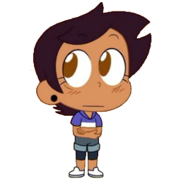

# PersonalTweaks

Hi! I'm Sarah, and this is my mod full of my own Personal stuff i want on the game.
This mod is a compilation of a bunch of small features, all in one.

You may be wondering a ton of stuff, but probably one of ur main questions is one of these:
- Why isn't this mod on the Index?
- Why doesn't this mod have any releases?
- Why do some of this mod's features seem familiar?

Well, first of all, some of the features on this mod ARE indeed from other mods, they're only part of this mod bc i do NOT want to install other mods for a single feature they have. So, i just took em and added them to this mod, along some other features i did make myself.
So, here's a breakdown!

## Credits
*features i didn't make myself*

- Legacy Trail: Taken from [EclipseMenu.](https://github.com/EclipseMenu/EclipseMenu)
- Ball Rotation Bug: Taken from [QOLMod.](https://github.com/TheSillyDoggo/GeodeMenu)

## My Features
*stuff i DID make myself*

- Wave Particles Fix: Fixes the issue where dragging particles show up on the Wave Gamemode sometimes.
- Icon Randomizer: Randomizes icons either on death or on every gamemode switch in-game. Based on [Randomize Icon on Death](https://github.com/kittenchilly/Randomize-Icon-on-Death) and [MHv5's](https://github.com/absoIute/Mega-Hack-v5) Icon Randomizer.
- Noclip Totem of Undying: Shows Minecraft's Totem of Undying anymation on every noclip death. Based on [Totem of Undying.](https://github.com/YellowCat98/TotemofUndying-gd)

Will any of the original features ever see the light of day as a standalone mod?
Probably lol idk
